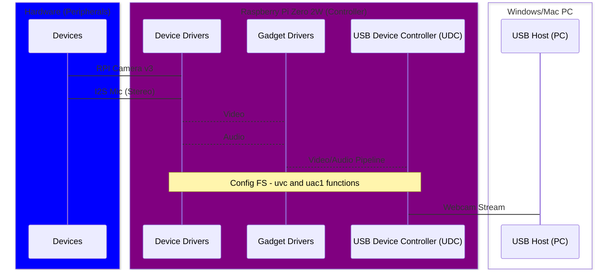

# Overview
Senior Design - RPI as an embedded AI plug-and-play webcam.

Materials:
1. Raspberry Pi Zero 2W (32-Bit Bullseye LITE)
2. Camera - RPI Camera Module V.3
3. Stereo Microphone - SPH0645 (Qty. 2)
4. Cables - Micro-USB Power and Micro-USB 2.0 Data
5. Buttons/LED - Three buttons (pwr, toggle stream, toggle function)

Power Estimate:
1. rpi (idle state) 250mA --> 5.00V * 0.250A  = 1.25W
2. camera draws 200m      --> 5.00V * 0.200A   = 1.00W
3. I2S mics (2x) draws about --> 5.00V * 600uA * 2 = 0.006W - a lemon could power this - negligble (10uA sleep)
4. buttons/led - low

## Video Processing and Software Stack
The Big Picture:
The `Libcamera` software stack is primarily responsible for enabling access to camera data. It bypasses the GPU of which users do not have access to and provides the API interface for applications. Our AI functions are built on top of this framework. The computer vision library, `opencv`, will be responsible for autonomously manipulating the live video stream. Autonomous behavior is defined by the combination of logic, prebuilt ML models, and event loops. However, `opencv` (for some reason) relies on `pycamera2` to grab frames. `v4l2` (Linux video/camera kernel interface) is the low-level interface between user-space and the kernel. The goal is to define a camera system comprised of the following software grouped by function:
1) Computer vision and processing --> `opencv` and `picamera2` will work together to acquire and manipulate frames.
  To do: Direct output to an images/slideshow directory, buffer, or other output type accessible by uvc-gadget program.
2) Host-side Control and GPIO signaling - Build on top of working `ConfigFS` framework in the `processing` or `extension unit (xu)` directory to query and respond to IOCTL requests and GPIO signals. For example, toggle blur effect or camera stream on and off. File descriptors in this directory rely on the uvc-chain configuration (source/output ids). May need to tear down or build up  after disable or enable signal is received - in runtime.
   To do: Check compatibility with `v4l2` api
3) USB output and Pipeline config: `uvc-gadget` utilizes various libraries, but a logical start would be to discern the difference in choosing the current default, `Libcamera` as a video source, and `v4l2` directory pointers. `Libcamera` is certainly a valid video source and `v4l2` details our main video stream as a sub-device which is a layer below media device.
   To do: Understand the interaction between `uvc-gadget` and `v4l2` - `libcamera` would be worth a second look.

Video=Pictures:
Video is produced by transmitting individual frames at a certain frequency (i.e., 30 fps). So a set of pictures being displayed sequentially and at a rate that makes it appear seamless, we call a video. Resolution is the pixel density i think and a pixel contains a color value corresponding to the selected color group (i.e., RGB, BGR, Grayscale, HSV, etc). Data acquired from the camera module is stored in frame buffers which are responsible for temporarily storing data while its being moved. Once data has traveled safely to its destination, we need to destroy it so the memory it occupied is now free - literally using either a `release()` or `destroy()` function call.

## V4L2 Devices
I'm just assuming this to be a compatibility layer between higher level libcamera API and lower level uvc-driver implementations. It's clear V4L2 video devices get created as a result of both camera detection (libcamera media controller) and ConfigFS function to UDC binding (`rpi-webcam-gadget.sh` creates `/dev/video2`).

Probably important:

[V4L2 Events](https://www.kernel.org/doc/html/v4.9/media/kapi/v4l2-event.html)

[V4l2 IOCTL OPS](https://www.kernel.org/doc/html/v4.9/media/kapi/v4l2-videobuf.html#ioctl-operations)

### 3 buffer types
1) For scatter/gather DMA ops: Buffers which are scattered in both the physical and (kernel) virtual address spaces. (Almost) all user-space buffers are like this, but it makes great sense to allocate kernel-space buffers this way as well when it is possible. Unfortunately, it is not always possible; working with this kind of buffer normally requires hardware which can do scatter/gather DMA operations.
3) Allocated with `vmalloc()`: Buffers which are physically scattered, but which are virtually contiguous; buffers allocated with vmalloc(), in other words. These buffers are just as hard to use for DMA operations, but they can be useful in situations where DMA is not available but virtually-contiguous buffers are convenient.
4) Buffers which are physically contiguous. Allocation of this kind of buffer can be unreliable on fragmented systems, but simpler DMA controllers cannot deal with anything else.

I think we use (2), at least in uvc-gadget driver.

## Event Loop

### Libcamera
"Event loop receives a message with a new set of frames from the camera system. This set of frames is called a `CompletedRequest`. It contains all the images that have been derived from that single camera frame (i.e., lores, full-size)."
Example --> application extracts `CompletedRequestPtr` from the message, which is the shared pointer to the `CompletedRequest`.
### UVC Related
`uvc-gadget` driver essentially gets the ball rolling - initializes camera src, subscribing/registering to events, parsing ConfigFS (grabbing attributes), allocates buffers, and eventually passes it off to an event loop which listens for events and passes data when requested. After the initialization process, the event loop is somewhat of an autonomous entity. An important thing to note in regard to control is `signal(SIGINT, sigint_handler);` in `main.c`. This registers a signal handler for `SIGINT`, right now it's received upon `CTRL-C` - perhaps we can source this (or similar) signal from our gpio driver.


### Control and Event notes
Eventually we want to start/stop/toggle between stream delivery methods effectively and without locking up memory or controls. The first step is to install buttons to gpio and listen using the pigpiozero lib (.py) to trigger basic terminal commands. The next step will be to pass/emit events to the correct places - if it's not too involved. We may have to just pass hard start and kill cmds to terminal to emulate (fake) some sophisticated level of control.

we'll have to handle events differently depending on whether we initialize a v4l2 or libcamera source - see bottom of this page for v4l2 and libcamera source driver snippets.
```C
	/*
	 * Create the events handler. Register a signal handler for SIGINT,
	 * received when the user presses CTRL-C. This will allow the main loop
	 * to be interrupted, and resources to be freed cleanly.
	 */
	events_init(&events);

	sigint_events = &events;
	signal(SIGINT, sigint_handler);

if (cap_device)
	v4l2_video_source_init(src, &events);

#ifdef HAVE_LIBCAMERA
	if (camera)
		libcamera_source_init(src, &events);
#endif
```

[Danny's UVC breakdown](https://github.com/odin5on/pi-webcam/blob/main/uvc-explained.md)

## Top-Level Diagram
More like a block diagram


## ConfigFS Framework (See Docs)
- Purpose: Create gadget device, define attributes, and bind to a UDC driver. 
- `webcam-gadget.sh` has been modified to include audio function - UAC2
- 	UAC2 is used as opposed to UAC1 to support 32-bit playback... UAC1 has been verified to work, but an extra software conversion step is required.

>> In USB protocol interactions, the device driver is the master (or “client driver”) and the gadget driver is the slave (or “function driver”).

>> The gadget API resembles the host side Linux-USB API in that both use queues of request objects to package I/O buffers, and those requests may be submitted or canceled.
>> They share common definitions for the standard USB Chapter 9 messages, structures, and constants. >>Also, both APIs bind and unbind drivers to devices.
>> The APIs differ in detail, since the host side’s current URB framework exposes a number of implementation details and assumptions that are inappropriate for a gadget API.
>> While the model for control transfers and configuration management is necessarily different (one side is a hardware-neutral master, the other is a hardware-aware slave), the endpoint I/0 API used here should also be usable for an overhead-reduced host side API.

Gadget Driver, FunctionFS, and DMAEngine references for understanding the relation between endpoints, `epX`, interfaces, and data transfer from IIO to USB stack.

[FunctionFS from Linux Docs](https://github.com/torvalds/linux/blob/master/Documentation/usb/functionfs.rst)

[Gadget Driver](https://www.kernel.org/doc/html/v4.16/driver-api/usb/gadget.html)

[DMAEngine](https://www.kernel.org/doc/html/v4.16/driver-api/dmaengine/provider.html)

Capture and playback soundcard should be properly installed after running `webcam-gadget.sh`:


  
UVC Gadget ConfigFS Initialization:


### UVC Gadget
Overview from (https://docs.kernel.org/usb/gadget_uvc.html)

>*The UVC Gadget driver is a driver for hardware on the device side of a USB connection. It is intended to run on a Linux system that has USB device-side hardware such as boards with an OTG port.*
>
>*On the device system, once the driver is bound it appears as a V4L2 device with the output capability.*
> 
>*On the host side (once connected via USB cable), a device running the UVC Gadget driver and controlled by an appropriate userspace program should appear as a UVC specification compliant camera, and function appropriately with any program designed to handle them.*
>
>*The userspace program running on the device system can queue image buffers from a variety of sources to be transmitted via the USB connection. Typically this would mean forwarding the buffers from a camera sensor peripheral, but the source of the buffer is entirely dependent on the userspace companion program.*

# Audio
[DMAEngine reference for hw driver](https://www.kernel.org/doc/html/v4.16/driver-api/dmaengine/provider.html)

To do: Integrate into pipeline using the built in libav codec - see syncing options available within the libcamera or v4l2 api and implement the function in uvc-gadget or other application.


## Audio Hardware
- Gadget Controller - Raspberry Pi Zero 2 W
- Microphones - ADAFRUIT SPH0645 (Stereo Configuration)

HW install reference: 
[Microphone Installation/Tutorial](https://learn.adafruit.com/adafruit-i2s-mems-microphone-breakout/raspberry-pi-wiring-test)

  LEFT MIC
  - 3.3V  Connector Pin 1
  - GND   GND
  - LRCL  Connector Pin 35 GPIO 19
  - DOUT  Connector Pin 38 GPIO 20
  - BCLK  Connector Pin 12 GPIO 18
  - SEL   Connector Pin GND

  RIGHT MIC
  - 3.3V  Connector Pin 1
  - GND   GND
  - LRCL  Connector Pin 35 GPIO 19
  - DOUT  Connector Pin 38 GPIO 20
  - BCLK  Connector Pin 12 GPIO 18
  - SEL   Connector Pin 3.3V
 
## Audio Software
See `audio/` directory for driver and install steps in readme. It's essentially the same as Paul Creaser's, but with changes to Makefile and naming in driver - see link below for original source.

[Paul Creaser's i2s mic driver](https://github.com/PaulCreaser/rpi-i2s-audio)

ALSA framework snapshot:


# Resources

Quick external module compile/install and symbol export/linking - useful for audio driver:

[External modules - kbuild](https://www.kernel.org/doc/Documentation/kbuild/modules.txt)

libav codec doc - bookworm specific, shouldnt change much tho:

[rpicam-apps libav tutorial](https://github.com/raspberrypi/documentation/blob/develop/documentation/asciidoc/computers/camera/rpicam_apps_libav.adoc)

GPIO Zero for hardware buttons:

[GPIO Zero - Controlling GPIO using Python](https://gpiozero.readthedocs.io/en/latest/recipes.html)

AI processing benchmarks on 64-bit OS:

[Pi-Zero 2W AI Benchmarks](https://qengineering.eu/install-64-os-on-raspberry-pi-zero-2.html)

Adding audio to video:

[ffmpeg adding audio to video](https://json2video.com/how-to/ffmpeg-course/ffmpeg-add-audio-to-video.html)

Could be used for camera section in docs later:

[Image Signal Processor - ISP Overview](https://www.utmel.com/blog/categories/integrated%20circuit/what-is-isp-image-signal-processor)

# Archives
Archives, honorable mentions, failed attempts - this is where I am hording currently unused or out of scope references/tutorials I stumbled upon.

1 of 1000 ways to install openCV:

[opencv install on rpi - Sam Westby Tech](https://www.youtube.com/watch?v=QzVYnG-WaM4)

Host Side USB

  - [IRQ - interrupt requests](https://www.techtarget.com/whatis/definition/IRQ-interrupt-request)

Client/Device Side USB

 - [ConfigFS Gadget](https://irq5.io/2016/12/22/raspberry-pi-zero-as-multiple-usb-gadgets/)
 - [Linux Kernel Building](https://www.raspberrypi.com/documentation/computers/linux_kernel.html#building-the-kernel)
 - [Linux-Header Install](https://www.raspberrypi.com/documentation/computers/linux_kernel.html#kernel-headers)
 - [Multi-gadget ConfigFS Example](https://gist.github.com/geekman/5bdb5abdc9ec6ac91d5646de0c0c60c4)
   `"On a mac, use ecm, rather than rndis."`
 - [ConfigFS Attribute Definitions](https://docs.kernel.org/usb/gadget_configfs.html)
  
Alternate Wide-Angle 3rd Party Cam - Arducam Camera Module 3
- Model - UC-A74 Rev. B
- SKU   - B0311
- Specs - 110deg, wide-angle, auto focus
- [Vendor Site](https://docs.arducam.com/Raspberry-Pi-Camera/Native-camera/12MP-IMX708/)

Check your OS version (32 or 64 bit): 

```getconf LONG_BIT ```

## `libcamera-source.cpp` in `uvc-gadget/lib` 
Snippet to save myself the time of relocating important calls and negotation methods on uvc-gadget side. When trying to pass a vanilla libcamerasrc directly to /dev/video2 via gstreamer and without running `uvc-gadget` I get an error like, "not negotiated error -4", pretty sure the `outputReadyCallback()` and `validate()` make this work. 

```C
static void libcamera_source_destroy(struct video_source *s)
{
	struct libcamera_source *src = to_libcamera_source(s);

	src->camera->requestCompleted.disconnect(src);

	/* Closing the event notification file descriptors */
	close(src->pfds[0]);
	close(src->pfds[1]);

	src->camera->release();
	src->camera.reset();
	src->cm->stop();
	delete src;
}

static int libcamera_source_set_format(struct video_source *s,
				       struct v4l2_pix_format *fmt)
{
	struct libcamera_source *src = to_libcamera_source(s);
	StreamConfiguration &streamConfig = src->config->at(0);
	__u32 chosen_pixelformat = fmt->pixelformat;

	streamConfig.size.width = fmt->width;
	streamConfig.size.height = fmt->height;
	streamConfig.pixelFormat = PixelFormat(chosen_pixelformat);

	src->config->validate();

#ifdef CONFIG_CAN_ENCODE
	/*
	 * If the user requests MJPEG but the camera can't supply it, try again
	 * with YUV420 and initialise an MjpegEncoder to compress the data.
	 */
	if (chosen_pixelformat == V4L2_PIX_FMT_MJPEG &&
	    streamConfig.pixelFormat.fourcc() != chosen_pixelformat) {
		std::cout << "MJPEG format not natively supported; encoding YUV420" << std::endl;

		src->encoder = new MjpegEncoder();
		src->encoder->SetOutputReadyCallback(std::bind(&libcamera_source::outputReady, src, _1, _2, _3, _4));

		streamConfig.pixelFormat = PixelFormat(V4L2_PIX_FMT_YUV420);
		src->src.type = VIDEO_SOURCE_ENCODED;

		src->config->validate();
	}
#endif

	if (fmt->pixelformat != streamConfig.pixelFormat.fourcc())
		std::cerr << "Warning: set_format: Requested format unavailable" << std::endl;

	std::cout << "setting format to " << streamConfig.toString() << std::endl;

	/*
	 * No .configure() call at this stage, because we need to pick up the
	 * number of buffers to use later on so we'd need to call it then too.
	 */

	fmt->width = streamConfig.size.width;
	fmt->height = streamConfig.size.height;
	fmt->pixelformat = src->encoder ? V4L2_PIX_FMT_MJPEG : streamConfig.pixelFormat.fourcc();
	fmt->field = V4L2_FIELD_ANY;

	/* TODO: Can we use libcamera helpers to get image size / stride? */
	fmt->sizeimage = fmt->width * fmt->height * 2;

	return 0;
}

```

## `v4l2-source.c` in `uvc-gadget/lib`
/dev/video2 has been verified to effectively output stream via USB, but only when paired with libcamerasrc via cmd `uvc-gadget -c 0 uvc.0`:

```C
static int v4l2_source_stream_on(struct video_source *s)
{
	struct v4l2_source *src = to_v4l2_source(s);
	unsigned int i;
	int ret;

	/* Queue all buffers. */
	for (i = 0; i < src->vdev->buffers.nbufs; ++i) {
		struct video_buffer buf = {
			.index = i,
			.size = src->vdev->buffers.buffers[i].size,
			.dmabuf = src->vdev->buffers.buffers[i].dmabuf,
		};

		ret = v4l2_queue_buffer(src->vdev, &buf);
		if (ret < 0)
			return ret;
	}

	ret = v4l2_stream_on(src->vdev);
	if (ret < 0)
		return ret;

	events_watch_fd(src->src.events, src->vdev->fd, EVENT_READ,
			v4l2_source_video_process, src);

	return 0;
}

static int v4l2_source_stream_off(struct video_source *s)
{
	struct v4l2_source *src = to_v4l2_source(s);

	events_unwatch_fd(src->src.events, src->vdev->fd, EVENT_READ);

	return v4l2_stream_off(src->vdev);
}

static const struct video_source_ops v4l2_source_ops = {
	.destroy = v4l2_source_destroy,
	.set_format = v4l2_source_set_format,
	.set_frame_rate = v4l2_source_set_frame_rate,
	.alloc_buffers = v4l2_source_alloc_buffers,
	.export_buffers = v4l2_source_export_buffers,
	.free_buffers = v4l2_source_free_buffers,
	.stream_on = v4l2_source_stream_on,
	.stream_off = v4l2_source_stream_off,
	.queue_buffer = v4l2_source_queue_buffer,
};
```
