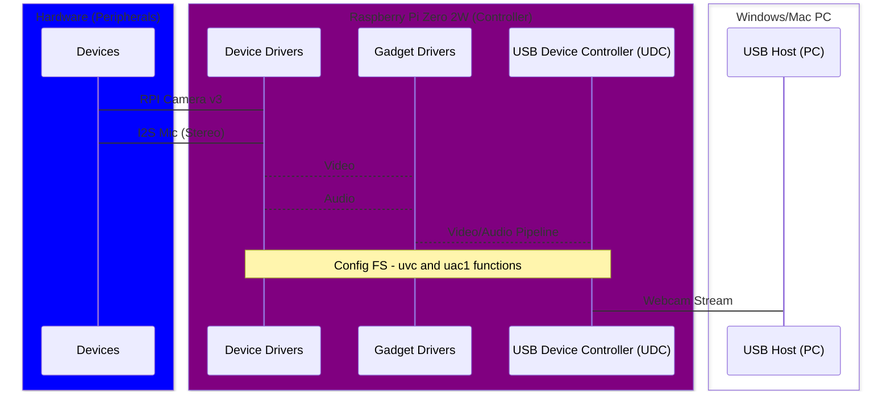

# Overview
Senior Design - RPI as an embedded AI plug-and-play USB2.0 webcam, 
Materials:
1. Raspberry Pi Zero 2W (32-Bit Bullseye LITE)
2. Camera - RPI Camera Module V.3
3. Stereo Microphone - SPH0645 (Qty. 2)
4. Cables - Micro-USB Power and Micro-USB 2.0 Data

## Video Processing and Software Stack
The Big Picture:
The `Libcamera` software stack is primarily responsible for enabling access to camera data. It bypasses the GPU of which users do not have access to and provides the API interface for applications. Our AI functions are built on top of this framework. The computer vision library, `opencv`, will be responsible for autonomously manipulating the live video stream. Autonomous behavior is defined by the combination of logic, prebuilt ML models, and event loops. However, `opencv` cannot acquire frames independently, so it imports a friend to do the snag and grab - `pycamera2`. 

Video=Pictures:
Video is produced by transmitting individual frames at a certain frequency (i.e., 30 fps). So a set of pictures being displayed sequentially and at a rate that makes it appear seamless, we call a video. Resolution is the pixel density i think and a pixel contains a color value corresponding to the selected color group (i.e., RGB, BGR, Grayscale, HSV, etc). Data acquired from the camera module is stored in frame buffers which are responsible for temporarily storing data while its being moved. Once data has traveled safely to its destination, we need to destroy it so the memory it occupied is now free - literally using either a `release()` or `destroy()` function call.

## Top-Level Diagram
More like a block diagram

### ConfigFS Framework (See Docs)
- Purpose: Create gadget device, define attributes, and bind to a UDC driver. 

Structure:
- TOP: Upper Layers (network, fs, block I/O)
- MID: Gadget Drivers (use gadget API, functions, end points (EPx)
- LOW: Peripheral Drivers (HW, mic, camera)

# AI Stuff

Check your OS version (32 or 64 bit): 

```getconf LONG_BIT ```

***Opencv (Open Source Computer Vision Library):***

Description: Library of programming functions for real time computer vision operations - how we manipulate the video stream.

***Opencv Install for Python:*** [opencv install on rpi - Sam Westby Tech](https://www.youtube.com/watch?v=QzVYnG-WaM4)


# Audio Setup
- Gadget Controller - Raspberry Pi Zero 2 W
- Camera - RPi camera module v.2 (for now)
- Microphones - ADAFRUIT SPH0645 (Stereo Configuration)

## Audio Hardware
Source/reference: 
[Microphone Installation/Tutorial](https://learn.adafruit.com/adafruit-i2s-mems-microphone-breakout/raspberry-pi-wiring-test)

  LEFT MIC
  - 3.3V  Connector Pin 1
  - GND   GND
  - LRCL  Connector Pin 35 GPIO 19
  - DOUT  Connector Pin 38 GPIO 20
  - BCLK  Connector Pin 12 GPIO 18
  - SEL   Connector Pin GND

  RIGHT MIC
  - 3.3V  Connector Pin 1
  - GND   GND
  - LRCL  Connector Pin 35 GPIO 19
  - DOUT  Connector Pin 38 GPIO 20
  - BCLK  Connector Pin 12 GPIO 18
  - SEL   Connector Pin 3.3V
 
## Audio Software

Stereo Configuration works using Paul's driver.

Modified the dma_engine request to bcm2709 - not sure if this was necessary.

[Paul Creaser's i2s mic driver](https://github.com/PaulCreaser/rpi-i2s-audio)

```bash
# Working in mono config:
sudo nano /boot/config.txt # uncomment dtparam=i2s=on (i enabled the i2c_arm and spi params as well)
git clone https://github.com/PaulCreaser/rpi-i2s-audio
cd rpi-i2s-audio/

# Change dma_engine=bcm2708-dmaengine to dma_engine=bcm2709-dmaengine
sudo nano my_loader.c

# install latest kernel headers if necessary
sudo apt-get install raspberrypi-kernel-headers

# build my_loader module
make -C /lib/modules/$(uname -r)/build M=$(pwd) modules
sudo insmod my_loader.ko

# Check if capture card is available
arecord -l && arecord -L

# Try recording - volume will be low but vumeter should react (2% by default for me)
arecord -D plughw:1 -c 2 -r 48000 -f S32_LE -V stereo -v -t wav test.wav

# may need to reboot and insmod again
# i believe this would call my_loader on boot:
echo "my_loader" | sudo tee -a /etc/modules
```


### Combine/sync to Video
Maybe the way
[rpicam-apps libav tutorial](https://github.com/raspberrypi/documentation/blob/develop/documentation/asciidoc/computers/camera/rpicam_apps_libav.adoc)

# Resources

GPIO Zero for hardware buttons

[GPIO Zero - Controlling GPIO using Python](https://gpiozero.readthedocs.io/en/latest/recipes.html)

[Pi-Zero 2W AI Benchmarks](https://qengineering.eu/install-64-os-on-raspberry-pi-zero-2.html)

[ffmpeg adding audio to video](https://json2video.com/how-to/ffmpeg-course/ffmpeg-add-audio-to-video.html)

[Image Signal Processor - ISP Overview](https://www.utmel.com/blog/categories/integrated%20circuit/what-is-isp-image-signal-processor)

## v4l2 
V4L2 Video/Media node descriptions


### Archive Graveyard
Archives, honorable mentions, failed attempts - this is where I am hording currently unused or out of scope references/tutorials I stumbled upon.

### Software Dependency archive
Putting old software install and build instructions here so as to not be confused with current build.

### Installation History (not current - reflashed w/ fresh Bullseye image)
```bash
# Currently using -> 6.1.21-v7+ #1642 SMP Mon Apr  3 17:20:52 BST 2023 armv7l GNU/Linux

# libcamera / rpicam
sudo apt install -y libcamera-dev libjpeg-dev libtiff5-dev libpng-dev
sudo apt install libavcodec-dev libavdevice-dev libavformat-dev libswresample-dev
sudo apt install -y git

# libcamera
sudo apt install -y libboost-dev
sudo apt install -y libgnutls28-dev openssl libtiff5-dev pybind11-dev
# sudo apt install -y qtbase5-dev libqt5core5a libqt5gui5 libqt5widgets5 we don't need preview window
sudo apt install -y meson cmake
sudo apt install -y python3-yaml python3-ply
sudo apt install -y libglib2.0-dev libgstreamer-plugins-base1.0-dev

# codeblocks
sudo apt install codeblocks

# open-cv
sudo apt install libopencv-dev
sudo apt install python3-opencv

#  v4l2-utils 
sudo apt install v4l2loopback-dkms v4l2loopback-utils ffmpeg

# Gstreamer for pipeline
sudo apt install python3-pip python3-yaml libyaml-dev python3-ply python3-jinja2
sudo apt install libx264-dev libjpeg-dev libgstreamer1.0-dev \
     libgstreamer-plugins-base1.0-dev \
     libgstreamer-plugins-bad1.0-dev \
     gstreamer1.0-plugins-ugly \
     gstreamer1.0-tools \
     gstreamer1.0-gl \
     gstreamer1.0-gtk3

# Ignore this, reference only
# git clone https://git.libcamera.org/libcamera/libcamera.git
# cd libcamera
# meson setup build
# ninja -C build install

# [Camera Tuning Guide](https://datasheets.raspberrypi.com/camera/raspberry-pi-camera-guide.pdf?_gl=1*ahfnux*_ga*Nzc4ODQ2NDAwLjE3MDk5NTExMTU.*_ga_22FD70LWDS*MTcxMDg4MzY0Ny40Ny4xLjE3MTA4ODU5MDMuMC4wLjA.)
```

### Custom libcamera build (old - reflashed)
[libcamera/rpicam build tutorial](https://www.raspberrypi.com/documentation/computers/camera_software.html#building-libcamera-and-rpicam-apps)
```bash
# If not already cloned:
git clone https://git.libcamera.org/libcamera/libcamera.git
cd libcamera
meson setup build --buildtype=release -Dpipelines=rpi/vc4,rpi/pisp -Dipas=rpi/vc4,rpi/pisp -Dv4l2=true -Dgstreamer=enabled -Dtest=false -Dlc-compliance=disabled -Dcam=disabled -Dqcam=disabled -Ddocumentation=disabled -Dpycamera=enabled
```


### Custom rpicam build (old - reflashed)
[libcamera/rpicam build tutorial](https://www.raspberrypi.com/documentation/computers/camera_software.html#building-libcamera-and-rpicam-apps)
```bash
# Make sure build tools are installed
sudo apt install -y meson ninja-build
# If not already cloned
git clone https://github.com/raspberrypi/rpicam-apps.git
cd rpicam-apps
meson setup build -Denable_libav=true -Denable_drm=true -Denable_egl=false Denable_qt=false -Denable_opencv=true -Denable_tflite=false
meson compile -j1 -C build
sudo meson install -C build
```


## Resource Archive

No longer referencing these:
[Gstreamer Bullseye Setup (ignore - for pi4](https://qengineering.eu/install-gstreamer-1.18-on-raspberry-pi-4.html)
[Build Stuff (ignore)](https://bootlin.com/blog/enabling-new-hardware-on-raspberry-pi-with-device-tree-overlays/#:~:text=The%20Raspberry%20Pi%20kernel%20tree%20contains%20a%20number,stored%20in.dts%20file%20gets%20compiled%20into%20a.dtbo%20files.)

Host Side USB

  - [IRQ - interrupt requests](https://www.techtarget.com/whatis/definition/IRQ-interrupt-request)

Client/Device Side USB

 - [ConfigFS Gadget](https://irq5.io/2016/12/22/raspberry-pi-zero-as-multiple-usb-gadgets/)
 - [Linux Kernel Building](https://www.raspberrypi.com/documentation/computers/linux_kernel.html#building-the-kernel)
 - [Linux-Header Install](https://www.raspberrypi.com/documentation/computers/linux_kernel.html#kernel-headers)
 - [Multi-gadget ConfigFS Example](https://gist.github.com/geekman/5bdb5abdc9ec6ac91d5646de0c0c60c4)
   `"On a mac, use ecm, rather than rndis."`
 - [ConfigFS Attribute Definitions](https://docs.kernel.org/usb/gadget_configfs.html)
  
Alternate Cam

Arducam Camera Module 3 (Third Party)
- Model - UC-A74 Rev. B
- SKU   - B0311
- Specs - 110deg, wide-angle, auto focus
- [Vendor Site](https://docs.arducam.com/Raspberry-Pi-Camera/Native-camera/12MP-IMX708/)

(OLD) TO DO:
- Use ConfigFS framework to reconfigure our current pipeline from the tutorial [the plug-and-play tutorial gives a solid stream but we need to reconfigure](https://gitlab.freedesktop.org/camera/uvc-gadget/)
- Important: [Camera Tuning Guide](https://datasheets.raspberrypi.com/camera/raspberry-pi-camera-guide.pdf?_gl=1*ahfnux*_ga*Nzc4ODQ2NDAwLjE3MDk5NTExMTU.*_ga_22FD70LWDS*MTcxMDg4MzY0Ny40Ny4xLjE3MTA4ODU5MDMuMC4wLjA.)
- [Video] Figure out which node will take care of post-processing (add features)
-   do we have enough memory allocated?
  
- [Audio] Avoid any processing --> sink straight to usb endpoint
-   Include audio function in uvc-gadget app


